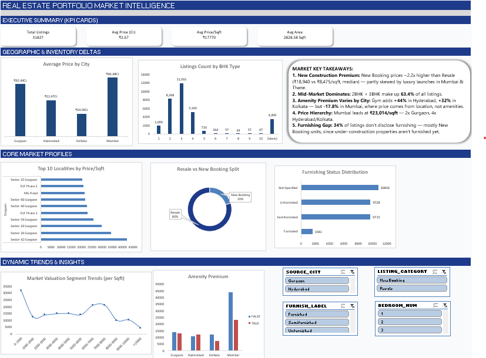

# Real Estate Market Dashboard — Gurgaon, Hyderabad, Kolkata & Mumbai

An end-to-end data analytics project: cleaning, merging, and visualizing residential real estate listings across four major Indian metros, built into an interactive Excel dashboard.

## 🖼️ Dashboard Preview



## 📊 Project Overview

Raw listing data scraped from 99acres comes in inconsistently per city — different columns, encoded categorical fields, messy price/area text, and mixed listing types (resale, new launches, PG rentals, land). This project cleans and standardizes that data into one unified dataset, then builds a dashboard that surfaces real market insights.

## 🗂️ Repository Structure

```
├── notebooks/
│   └── EDA.ipynb                          # Data cleaning, decoding, and merging pipeline
├── output/
│   └── combined_real_estate_cleaned.xlsx  # Full cleaned dataset (38,487 listings, all categories)
├── assets/
│   └── dashboard_preview.png              # Dashboard screenshot
├── dashboard_data.xlsx                    # Final Excel dashboard (filtered to Resale + New Booking)
└── README.md
```

> Raw source CSVs are excluded from this repo (see `.gitignore`) — only cleaned outputs and the code that produced them are tracked.

## 🧹 Data Cleaning Highlights

- Merged 4 separate city files (different column sets) into one consistent schema
- Decoded numeric facet codes (`AGE`, `FURNISH`, `FACING`, `OWNERSHIP`) into readable labels using lookup tables
- Parsed free-text `PRICE` fields (`"2.63 Cr"`, `"69.25 L"`, `"1.5 - 5.99 L"`, `"Price on Request"`) into clean numeric values
- Parsed free-text `AREA` fields (including ranges) into numeric sqft
- Classified every listing into **Resale**, **New Booking**, **PG/Shared Rental**, or **Land Sale** based on transaction signals
- Extracted locality and city names from nested location metadata
- Flagged data-quality outliers using category-aware thresholds (1.23% of rows) instead of one-size-fits-all cutoffs
- Removed duplicate listings by property ID

## 📈 Dashboard

Built in Excel using PivotTables, slicers, and charts — filtered to actual for-sale residential listings (Resale + New Booking, outliers excluded; **31,827 listings**).

**Includes:**
- KPI summary: Total Listings, Avg Price, Avg Price/Sqft, Avg Area
- Average Price by City
- Listings Count by BHK Type
- Top 10 Localities by Price/Sqft (per city)
- Resale vs New Booking Split
- Furnishing Status Distribution
- Price/Sqft Distribution
- Amenity Premium Analysis (gym-equipped vs not, by city)
- Interactive slicers: City, BHK, Listing Category, Furnish Status

## 🔍 Key Findings

1. **New Construction Premium** — New Booking units price ~2.2x higher than Resale (₹18,940 vs ₹8,475/sqft, median), skewed upward by luxury launches in Mumbai & Thane.
2. **Mid-Market Dominates** — 2BHK + 3BHK make up 63.4% of all listings.
3. **Amenity Premium Varies by City** — A gym adds +44% to price/sqft in Hyderabad and +32% in Kolkata, but -17.8% in Mumbai, where price is driven by location/scarcity rather than amenities.
4. **Price Hierarchy** — Mumbai leads at ₹23,014/sqft (median) — roughly 2x Gurgaon and 4x Hyderabad/Kolkata.
5. **Furnishing Gap** — 34% of listings don't disclose furnishing status, almost entirely New Booking units (under-construction properties aren't furnished yet).

## 🛠️ Tools Used

- Python (pandas, numpy) for data cleaning and merging
- Jupyter Notebook
- Microsoft Excel (PivotTables, PivotCharts, Slicers)

## 📌 Data Source

Residential listing data for Gurgaon, Hyderabad, Kolkata, and Mumbai (scraped from 99acres).